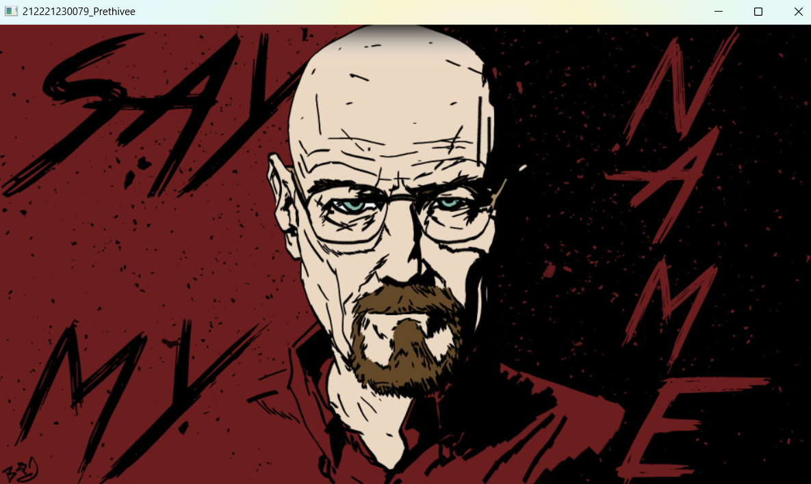
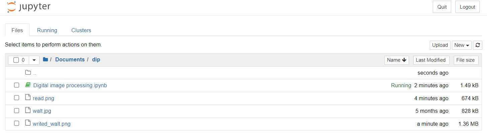
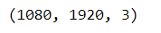
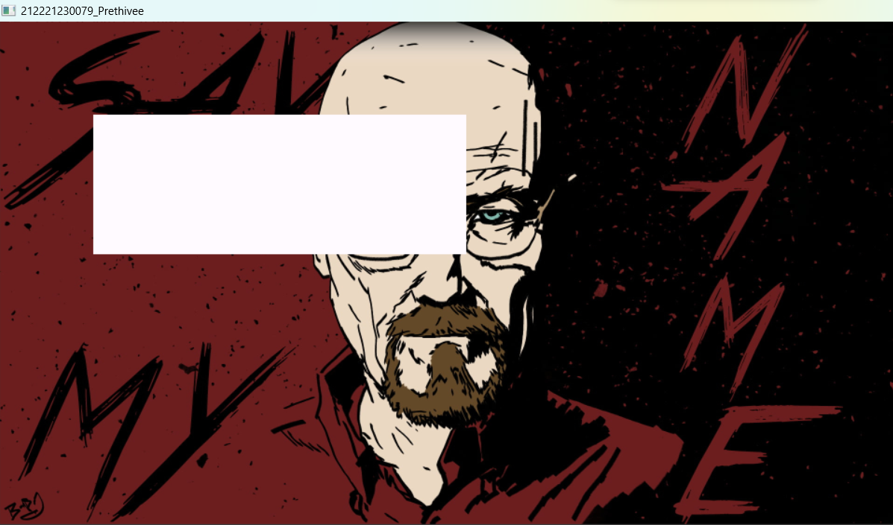
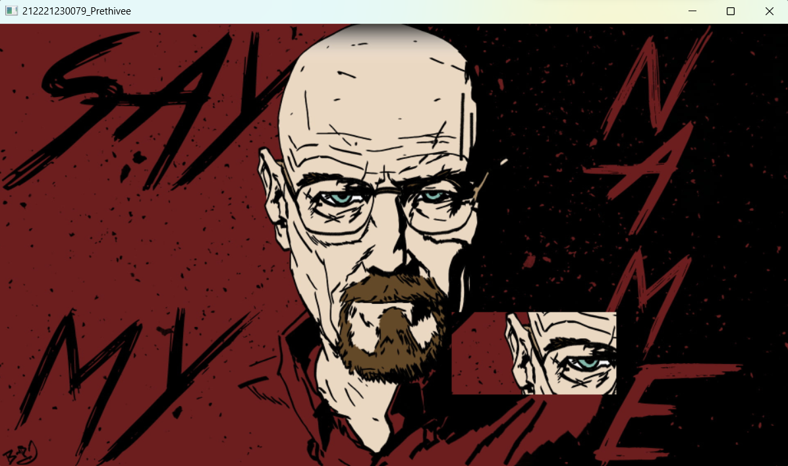

# READ AND WRITE AN IMAGE
## AIM
To write a python program using OpenCV to do the following image manipulations.
i) Read, display, and write an image.
ii) Access the rows and columns in an image.
iii) Cut and paste a small portion of the image.

## Software Required:
Anaconda - Python 3.7
## Algorithm:
### Step1:
Choose an image and save it as a filename.jpg
### Step2:
Use imread(filename, flags) to read the file.
### Step3:
Use imshow(window_name, image) to display the image.
### Step4:
Use imwrite(filename, image) to write the image.
### Step5:
End the program and close the output image windows.
## Program:
### Developed By:
```
212221230079
Prethiveerajan P
```
### Register Number: 
i) #To Read,display the image
```
import cv2


img = cv2.imread('walt.jpg', -1)


resized_img = cv2.resize(img, None, fx=0.5, fy=0.5, interpolation=cv2.INTER_LINEAR)

cv2.imshow('212221230079_Prethivee', resized_img)


cv2.waitKey(0)
cv2.destroyAllWindows()


  

```
ii) #To write the image
```
import cv2
img=cv2.imread('walt.jpg',-1)
cv2.imwrite('writed_walt.png',img)


```
iii) #Find the shape of the Image
```
import cv2
img=cv2.imread('walt.jpg',-1)
print(img.shape)


```
iv) #To access rows and columns

```
import cv2
# img=cv2.imread('walt.jpg',-1)
img = cv2.imread('walt.jpg', -1)


resized_img = cv2.resize(img, None, fx=0.5, fy=0.5, interpolation=cv2.INTER_LINEAR)
for i in range(100,250):
 for j in range(100,500):
     resized_img[i][j]=[255,250,255] #blue green red
cv2.imshow('212221230079_Prethivee',resized_img);
cv2.waitKey(0)
cv2.destroyAllWindows()


```
v) #To cut and paste portion of image
```
import cv2
img1=cv2.imread('walt.jpg',-1)
resized_img = cv2.resize(img, None, fx=0.5, fy=0.5, interpolation=cv2.INTER_LINEAR)
copied_portion=resized_img[150:250,250:450]
resized_img[350:450,550:750]=copied_portion
cv2.imshow('212221230079_Prethivee',resized_img)
cv2.waitKey(0)
cv2.destroyAllWindows()


```

## Output:

### i) Read and display the image



### ii)Write the image



### iii)Shape of the Image



### iv)Access rows and columns


### v)Cut and paste portion of image


## Result:
Thus the images are read, displayed, and written successfully using the python program.
